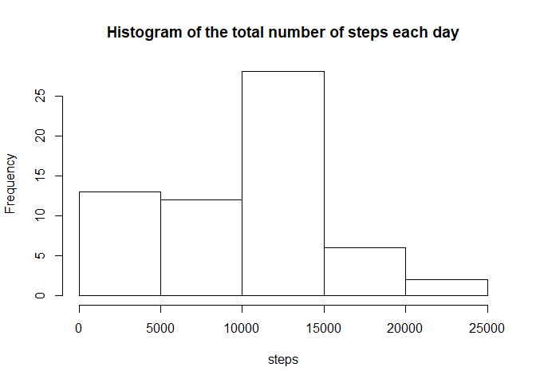
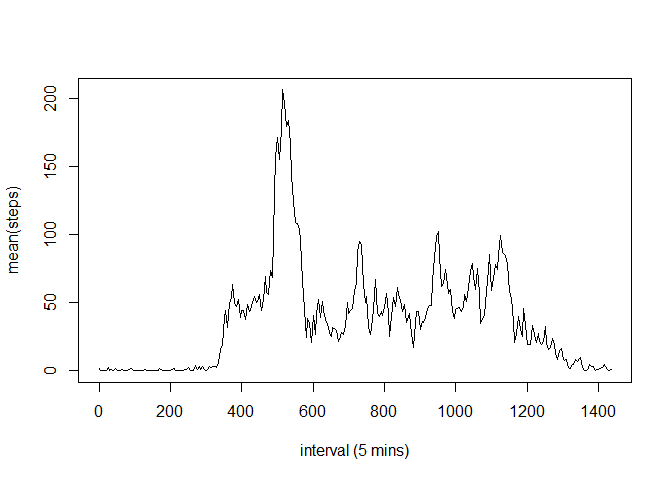
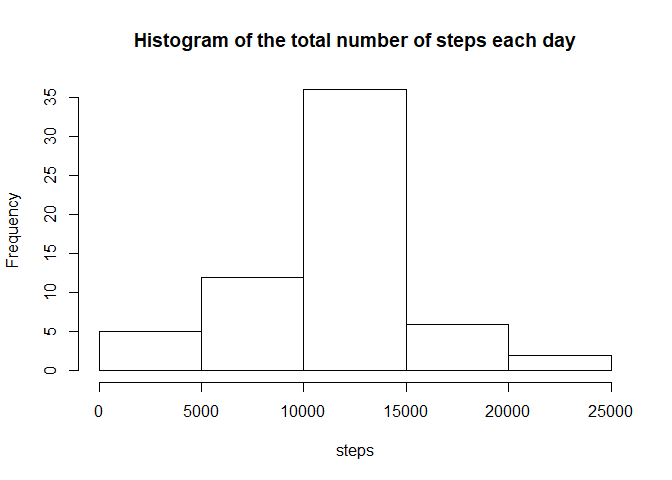
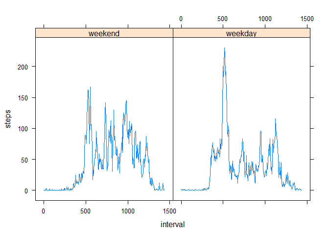

I unzip and read the data:

```r
unzip("exdata.zip")
```

```
## Warning in unzip("exdata.zip"): error 1 al extraer del archivo zip
```

```r
data <- read.csv("activity.csv")
```

I manipulate here data. I transform the dates from factor to date format and write properly the intervals:


```r
library(dplyr)
```

```
## 
## Attaching package: 'dplyr'
```

```
## The following objects are masked from 'package:stats':
## 
##     filter, lag
```

```
## The following objects are masked from 'package:base':
## 
##     intersect, setdiff, setequal, union
```

```r
data <- mutate(data,date=as.Date(as.character(date),format = "%Y-%m-%d"))
data$interval <- seq(from=0,to=1435,by=5)
```

I group data by dates:


```r
data_day <- group_by(data,date)
#Notice that I ignore the NA's
steps_day <- summarize(data_day, steps = sum(steps,na.rm=TRUE))
```

I generate the histogram with the number of steps:


```r
hist(steps_day$steps,main="Histogram of the total number of steps each day",xlab = "steps")
```

<!-- -->

I compute now the mean and average of steps_day$steps


```r
mean_steps <-  mean(steps_day$steps)
sprintf("mean = %.5f",mean_steps)
```

```
## [1] "mean = 9354.22951"
```

```r
median_steps <- median(steps_day$steps)
sprintf("median = %d",median_steps)
```

```
## [1] "median = 10395"
```

I group now data by the intervals, compute the average number of steps for each interval, plot the time series, and find the interval with the max of the average number of steps


```r
data_int <- group_by(data,interval)
avg_steps_int <- summarise(data_int,avg = mean(steps,na.rm=TRUE))
plot(avg_steps_int$interval,avg_steps_int$avg,type='l',ylab = "mean(steps)",xlab="interval (5 mins)")
```

<!-- -->

```r
max_avg <- which(avg_steps_int$avg==max(avg_steps_int$avg))
#interval with the highest mean number of steps. As This function returns the position in the vector, I compute the 5-minute interval by multiplying the quantity by 5 and substracting also 5.
sprintf("5-minute interval with the highest amount of steps on average = %d",avg_steps_int$interval[max_avg])
```

```
## [1] "5-minute interval with the highest amount of steps on average = 515"
```

I compute the number of missing data. Notice that steps is the only variable with NA's:


```r
missing <- sum(is.na(data$steps))
sprintf("number of NA's values = %d",missing)
```

```
## [1] "number of NA's values = 2304"
```

In order to fill the missing data, I choose the mean for the corresponding 5-minute interval, stored in the data frame avg_steps_int:


```r
data_new <- data
#Exploring the data, I realized that there're some dates (8 in particular) with no data (steps=NA for all the intervals) and the rest have no missing data (steps= some integer for all the intervals). Therefore, the next equality works: In the left-hand side there're the elements of steps equal to NA; in the right-hand side the vector with the average of steps for each interval.
data_new$steps[is.na(data_new$steps)] <- avg_steps_int$avg
```

I redo the histogram of the total number of steps each day, the mean, and the median by previously filling the missing data:


```r
data_new_day <- group_by(data_new,date)
#Notice that I ignore the NA's
steps_new_day <- summarize(data_new_day, steps = sum(steps))


hist(steps_new_day$steps,main="Histogram of the total number of steps each day",xlab = "steps")
```

<!-- -->

```r
mean_new_steps <-  mean(steps_new_day$steps)
sprintf("mean = %.5f",mean_new_steps)
```

```
## [1] "mean = 10766.18868"
```

```r
median_new_steps <- median(steps_new_day$steps)
sprintf("median = %.5f",median_new_steps)
```

```
## [1] "median = 10766.18868"
```

As seen, the mean and the median are now equal (surprising, it's not intuitive for me). The histogram, of course, also changes. It tends to be more symmetric. This makes sense, since we are introducing values around the mean value.

I analize now the steps depending on the part of the week (weekend or so-called weekday: Monday, Tuesday, ..., Friday). Then I plot the time series of the mean number of steps for weekends or weekdays:


```r
#I define a vector with the days of the week but Saturday and Sunday (notice that they're in Spanish)
weekdays1 <- c("lunes","martes","miércoles","jueves","viernes")
#I define a factor variable equal to FALSE if weekend and TRUE otherwise. I label these values as "weekend" and "weekday".
w <- factor((weekdays(data_new$date) %in% weekdays1),levels=c(FALSE, TRUE), labels=c("weekend", "weekday"))
#I define a new data frame with the new column
data_weekday <- mutate(data_new,weekday = w)
#I group data_weekday by weekday
data_w <- group_by(data_weekday,weekday,interval)
#I compute average of steps for each interval and kind of week day (weekday or weekend)
steps_day_w <- summarize(data_w, steps = mean(steps))

#I upload lattice:
library(lattice)
#I generate the panel
xyplot(steps ~ interval | weekday, data=steps_day_w,type="l")
```

<!-- -->
